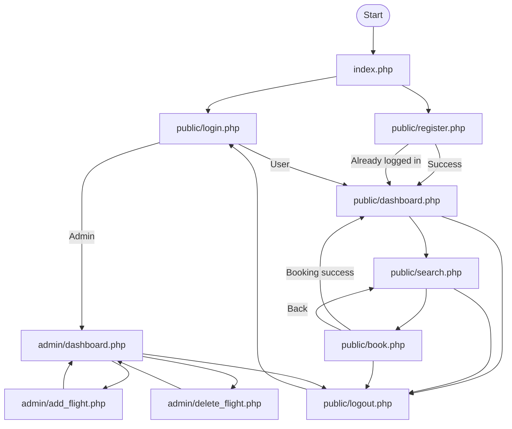
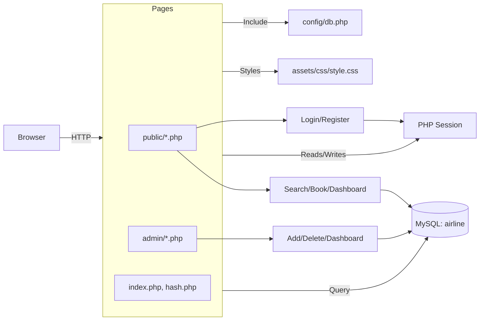

# Diagrams

## Page Linking (Flow)

```mermaid
flowchart TD
    Start([Start]) --> Index[index.php]
    Index --> Login[public/login.php]
    Index --> Register[public/register.php]

    Register -->|Success| UserDashboard[public/dashboard.php]
    Register -->|Already logged in| UserDashboard

    Login -->|Admin| AdminDashboard[admin/dashboard.php]
    Login -->|User| UserDashboard

    UserDashboard --> Search[public/search.php]
    UserDashboard --> Logout[public/logout.php]

    Search --> Book[public/book.php]
    Search --> Logout

    Book -->|Booking success| UserDashboard
    Book -->|Back| Search
    Book --> Logout

    AdminDashboard --> AddFlight[admin/add_flight.php]
    AdminDashboard --> DeleteFlight[admin/delete_flight.php]
    AdminDashboard --> Logout

    AddFlight --> AdminDashboard
    DeleteFlight --> AdminDashboard

    Logout --> Login
```

## Project Architecture

```mermaid
flowchart LR
    Browser[Browser] -->|HTTP| Pages[PHP Pages]
    Pages -->|Include| Config[config/db.php]
    Pages -->|Query| DB[(MySQL: airline)]
    Pages -->|Reads/Writes| Session[PHP Session]
    Pages -->|Styles| CSS[assets/css/style.css]

    subgraph Pages
        Public[public/*.php]
        Admin[admin/*.php]
        Root[index.php, hash.php]
    end

    Public --> Auth[Login/Register]
    Public --> SearchFlights[Search/Book/Dashboard]
    Admin --> ManageFlights[Add/Delete/Dashboard]

    Auth --> Session
    SearchFlights --> DB
    ManageFlights --> DB
```
